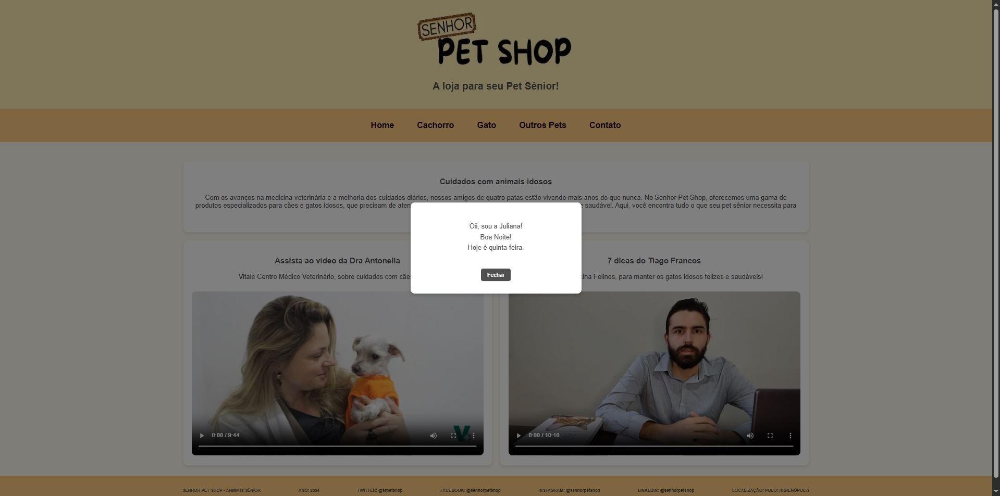

# 🐶 Senhor Pet Shop

Projeto de site para um pet shop especializado em **animais idosos**, desenvolvido como atividade prática da disciplina de Desenvolvimento Web (HTML, CSS e JS).

## ✨ Funcionalidades
- Página inicial com produtos e vídeos
- Páginas separadas para **cachorros** e **gatos**
- Design responsivo para mobile (480px)
- Formulário com campos obrigatórios e tipos diferentes

## 💻 usadas
- HTML5
- CSS3
- JavaScript (estrutura base)

## Melhorias futuras
- Integração com formulário real (back-end)
- Banco de dados para cadastro de produtos
- Área de login para clientes

## 🖼️ Preview

### Página Saudação:

### Página inicial:

### Página dos cachorros:

### Página gatos:

### Página outros:

### Página Contato:

